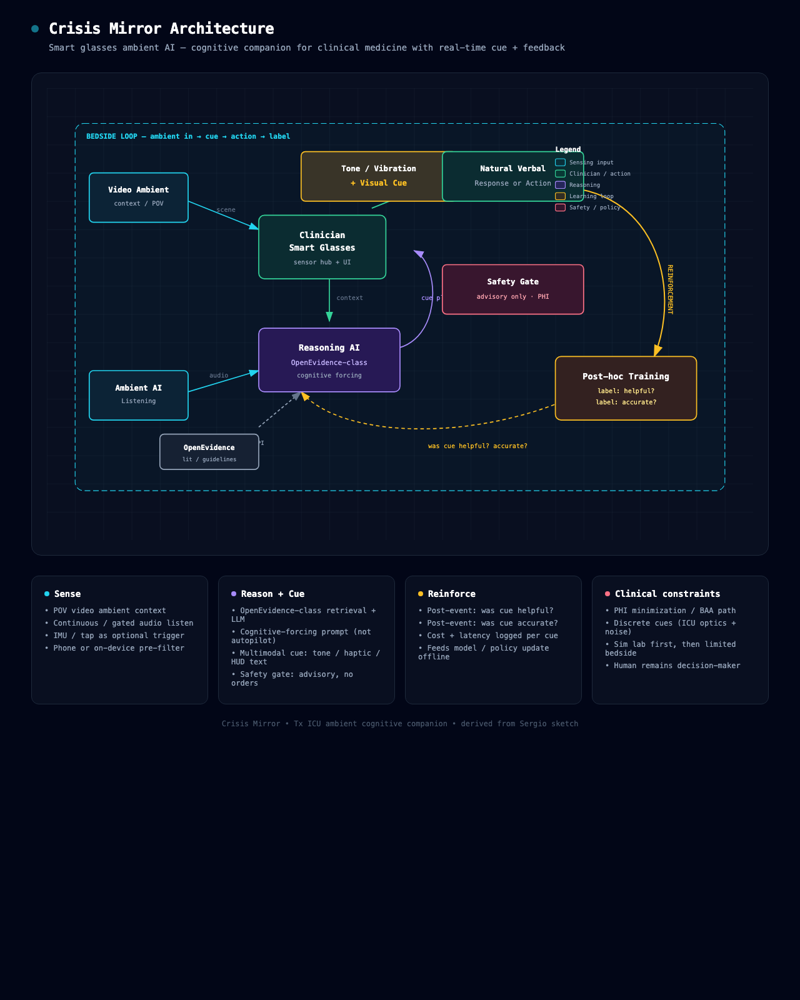

# Crisis Mirror

**Smart glasses ambient AI — cognitive companion for clinical medicine**  
Real-time cue + cost/quality feedback loop for transplant ICU / critical care.

## Concept

Ambient video + audio from clinician smart glasses → OpenEvidence-class reasoning → discrete multimodal cue (tone / haptic / HUD) → clinician action → post-hoc labels (*helpful?* *accurate?*) for training.

## Artifacts

| File | Description |
|------|-------------|
| [ONEPAGER.md](ONEPAGER.md) | Product brief, MVP, safety, hardware scorecard |
| [crisis-mirror-architecture.html](crisis-mirror-architecture.html) | Interactive dark architecture diagram |
| [assets/crisis-mirror-architecture.png](assets/crisis-mirror-architecture.png) | Architecture diagram (PNG) |
| [crisis-mirror-flow.excalidraw](crisis-mirror-flow.excalidraw) | Editable flow (open on [excalidraw.com](https://excalidraw.com)) |
| [assets/original-sketch.jpg](assets/original-sketch.jpg) | Original whiteboard sketch |

## Hardware lean

- **Primary:** [Brilliant Labs Halo](https://brilliant.xyz/) — camera + mics + bone conduction + HUD + open stack  
- **Alternate display:** Even Realities G2 — strong text HUD, no onboard camera/speakers  

Details in [ONEPAGER.md](ONEPAGER.md).

## Status

Early concept / sim-lab first. Not a medical device. Advisory cognitive-forcing only.

## License

Private working notes unless otherwise stated.
